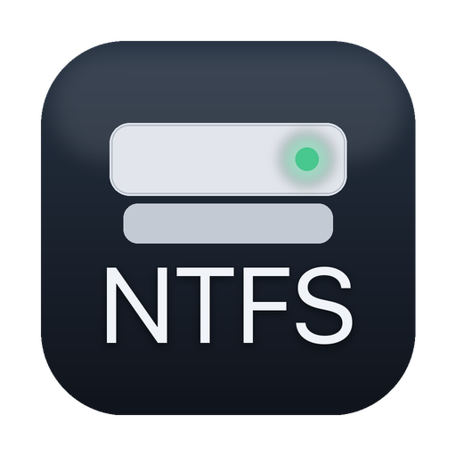

<p align="center"></p>

# TT NTFS Native

**NTFS read & write for macOS. No kernel extension. Free and open source.**

Mount NTFS disks and volumes in Finder — read *and* write — without lowering your
Mac's security or rebooting. Built on Apple's FSKit, so it runs in user space like
a normal app. GPL-2.0, and verified against Windows itself.

**[Download](https://github.com/dr-kbadawi/ttntfs/releases/latest/download/TT-NTFS-Native.dmg)** ·
[Website](https://dr-kbadawi.github.io/ttntfs/) ·
[Release notes](RELEASE-NOTES.md) ·
[Report a problem](https://github.com/dr-kbadawi/ttntfs/issues)

macOS 26 or later · Apple Silicon · 1.6 MB · notarized by Apple

## The first of its kind

Until now, writing to NTFS on a Mac meant one of two things: pay for a driver
that loads a kernel extension — which on Apple Silicon requires putting the
whole machine into Reduced Security and rebooting — or run an open-source FUSE
stack that needs a kernel extension of its own. Apple's built-in driver reads
NTFS but has not written to it since Ventura.

**TT NTFS Native is the first NTFS read/write driver for macOS that is free,
open source, and needs no kernel extension at all.** It installs like an app,
runs with your Mac's security fully intact, and can be read, audited and
improved by anyone.

## Why it's different

- **No kernel extension.** Full Security stays on. No reboot, no Recovery Mode,
  no third-party code in the kernel. Uninstalling is dragging an app to the Trash.
- **Verified against Windows.** Not just self-tested. Volumes this driver wrote
  were checked by Windows' own `chkdsk`, and its crash repair was compared record
  for record against what Windows does with the same damaged disk.
- **Symlinks that work both ways.** Links made on the Mac open on Windows.
  Junctions and directory links made on Windows resolve on the Mac. No other open
  driver manages both.
- **Honest about the journal.** A volume Windows didn't eject cleanly mounts
  read-only and tells you exactly why. Repairing it is one click, does what
  Windows would do, and is never silent or automatic.
- **Open source, all of it.** The driver, the app, the tests, and the engineering
  notes — including every bug found along the way and how it was found.
- **Small and native.** A menu-bar app and a system extension, in C and Swift.
  No background daemons, no telemetry, no account.

## Compared with the alternatives

Verified September 2026 against each vendor's shipped installer and
documentation. Full table with sources, including iBoysoft and EaseUS, in
[`docs/COMPARISON.md`](docs/COMPARISON.md).

| | TT NTFS Native | Apple built-in | Paragon 18 | Tuxera 26 | NTFS-3G + macFUSE |
|---|---|---|---|---|---|
| Price | **free** | free | $29.95 / major version | $28.95 | free |
| Open source | **yes, GPL-2.0** | no | no | no | yes |
| Kernel extension | **none** | none | required | required | required |
| Full Security on Apple Silicon | **yes** | yes | no | no | no by default |
| Write to NTFS | **yes** | no, removed since Ventura | yes | yes | yes |
| Mac-made symlinks open on Windows | **yes, verified** | — | ? | ? | no, by its manual |
| Windows junctions resolve on the Mac | **yes, verified** | no | ? | yes | yes |
| Repairs a volume after a crash | **yes — opt-in, reproduces Windows** | no | not claimed | yes, undocumented, automatic | no — clears the log |
| When repair cannot proceed | **refuses, writes nothing** | — | — | resets the journal, mounts anyway | — |
| Per-volume status in the menu bar | **yes** | no | yes | yes | no |
| Create compressed files | not yet | — | ? | experimental | yes |
| Intel Macs | not yet | yes | yes | yes | yes |
| Format NTFS | no, by design | no | yes | yes | yes |

## Performance

Absolute throughput depends on the disk and the enclosure, so the only honest
comparison is against another driver on the same hardware. Same 1 TB USB SSD,
same files, identical test, against Apple's built-in NTFS driver — the only
other kext-free option, and read-only:

- **+22%** faster sequential reads
- **+30%** faster random 4 KiB reads
- delete time **flat** regardless of directory size
- streaming writes **faster than Apple's own exFAT** driver on the same disk

The driver is not the bottleneck on ordinary USB storage: through the same code
on fast internal storage, writes sustain several times the USB figure. Random
small-block writes are the one area where it still trails; recorded as open
work. Method and raw figures in `docs/progress/`.

## How it was tested

A file system that writes to your disks should be held to a higher standard than
"it seemed to work". The bar here was Windows itself.

- **626 files** written by this driver, then checked by Windows `chkdsk`: no
  problems, and every file read back byte-for-byte. Covers the resident /
  non-resident boundary, fragmented 200 MiB files, a 500-entry index B-tree,
  255-unit, CJK and NFC-vs-NFD names, alternate data streams, hard links,
  symlinks, and a delete/rename churn. Procedure in `tools/phase2-gate/`.
- **4 of 4 real Windows crashes** with work to recover, captured on hardware:
  the driver's repair matched Windows' own on every one, record for record. In
  one test Windows never saw the journal — it only checked a volume this driver
  had already repaired — and found nothing to fix. See `docs/LOGFILE.md`.
- **3,400+ automated checks** across 15 test suites, run under the
  undefined-behaviour sanitizer on every push.
- **Two dozen defects** found and fixed along the way — nine of them in the
  Linux driver it was ported from — each with a test that fails if it comes
  back. The ledger is `docs/UPSTREAM-BUGS.md`.

## What works today

| | |
|---|---|
| Read and write, in Finder and the Terminal | yes |
| Long, Unicode and Windows-illegal names | yes — illegal names refused by default, switchable |
| Hard links, symlinks, alternate data streams | yes, verified on Windows |
| Reading compressed and sparse files | yes |
| Writing inside a Windows-compressed folder | yes — new files are stored uncompressed |
| Repair after a crash or unclean shutdown | yes — the same journal recovery Windows performs; opt-in per volume |
| 4Kn (native 4 KiB sector) disks | yes, measured |
| Creating compressed files | not yet |
| Intel Macs | not yet — Apple Silicon only |
| Format a disk as NTFS | no, by design — NTFS is for disks that come from Windows; a blank disk on a Mac should be exFAT |
| Repair structural corruption (bad records, orphaned files) | no — that is `chkdsk`'s job; this driver will not make a damaged volume worse |
| TRIM on SSDs | not possible — FSKit gives file systems no way to issue it |

## Using it

Install from the DMG, open the app, and press **Enable Extension**. The System
Settings switch for File System Extensions does not work for any third-party
FSKit module on macOS 26 — `fskitd` refuses the call from every caller lacking a
private Apple entitlement — which is why the app is unsandboxed and enables
itself. `fskit/README.md` has the detail, the evidence, and the known issues,
including what every switch in Settings actually does.

## Building

```
cmake -S . -B build && cmake --build build && ctest --test-dir build
```

The Xcode project is generated: `cd fskit && xcodegen`. Release builds are
Developer ID signed and notarized by `fskit/scripts/package.sh`; that needs the
certificate and a notarization credential.

## Checking

```
tools/ci.sh              # everything checkable without hardware or signing
tools/ci.sh --quick      # skip the slow fixture suite
tools/install-hooks.sh   # run --quick before every push
```

Four suites: **15 `ctest` targets (~3,200 checks)**, 265 fixture checks against
ntfsprogs as ground truth plus a real structural `fsck`, 52 Swift unit tests,
and a manual end-to-end mount test. Everything runs twice, instrumented with
UBSan and not. **`docs/TESTING.md` says what each covers and, more usefully,
what is still not covered.**

## Layout

| path | what |
|---|---|
| `upstream/` | pristine kernel source being ported; never edited |
| `core/ntfs/` | the ported driver (Tier 0/1), kept close to upstream |
| `core/vfs/` | the Linux VFS glue replaced with our own, behind one C ABI |
| `core/logfile/` | the `$LogFile` parser, analyser and replay engine |
| `platform/` | user-space implementation of the kernel API the core uses |
| `fskit/` | Xcode project: menu-bar app + FSKit extension + C bridge |
| `tools/` | `ntfscli` harness, fixture generator, test runner, CI |

## Documents

| file | what |
|---|---|
| `RELEASE-NOTES.md` | what changed in each build, and what to check after upgrading |
| `docs/TODO.md` | open work, grouped by what blocks it |
| `docs/PORTING.md` | why this source, the dependency survey, phases, decisions |
| `docs/TESTING.md` | what is checked, what is not, how to add a test |
| `docs/LOGFILE.md` | `$LogFile` format, replay algorithm, verified vs inferred |
| `docs/CONTRACTS.md` | interface ownership between work streams |
| `docs/progress/` | per-area findings, measurements, and open questions |
| `COPYRIGHT` | licensing, and why two SPDX identifiers are in use |

## Licence

GPL-2.0. The core derives from the Linux kernel's `fs/ntfs`, so the licence is
inherited rather than chosen. Copyright (c) 2026 TechTag GmbH for the port, the
FSKit extension, the app and the journal work; the original authors' notices
are preserved in the ported files. Full text in `LICENSE`, details in
`COPYRIGHT`.
